🚀 Configure Jenkins & Pipeline for Building Application CI/CD

With the DevOps platform successfully deployed, the next step is configuring Jenkins to build, scan, package, and deploy applications using Kubernetes-based agents and securely managed secrets.

In this section, you'll integrate Jenkins with SonarQube, HashiCorp Vault, Kubernetes, and Maven, then verify the setup by running test pipelines before building the complete application CI/CD pipeline on jenkins as statefulset.

📌 What You'll Configure

| Step    | Description                              |
| ------- | ---------------------------------------- |
| 🔌 15.1 | Install Required Jenkins Plugins         |
| ⚙️ 15.2 | Configure Global Tool Integrations       |
| ☸️ 15.3 | Configure Kubernetes Cloud               |
| 🧪 15.4 | Validate Kubernetes Cloud                |
| 🔐 15.5 | Validate Vault Integration               |
| 🚀 15.6 | Configure the Application Build Pipeline |

Open your browser and navigate to:
```text
http://jenkins.local
```
and login 

---
🔌 Install Required Jenkins Plugins

Before creating the CI/CD pipelines, install the plugins required for Kubernetes agents, Vault integration, SonarQube analysis, Maven configuration, and pipeline execution.

Navigate to
```text
Manage Jenkins
    ↓
Plugins
    ↓
Available Plugins
```


Install the following plugins:

| Plugin                        | Purpose                              |
| ----------------------------  | ------------------------------------ |
| ☸ Kubernetes                  | Dynamic Jenkins agents on Kubernetes |
| 🔐 HashiCorp Vault            | Retrieve secrets securely            |
| 🔍 SonarQube Scanner          | Code quality analysis                |
| ☕ Pipeline Maven Integration | Maven pipeline support               |
| 📄 Config File Provider       | Manage Maven settings.xml            |
| 📦 Docker Pipeline            | Docker build & push                  |
| 📁 Git                        | Source code checkout                 |
| 🧩 Pipeline stage view        | Jenkins Pipeline support             |

💡 Restart Jenkins after installing all plugins.

---
⚙️ Configure Global Tool Integrations

After installing the plugins, configure Jenkins to communicate with the external services used throughout the CI/CD pipeline.

In this section you will configure:

🔍 SonarQube Server
🔐 HashiCorp Vault
☕ Maven Global Settings

🔍 Configure SonarQube

Navigate to
```text
Manage Jenkins
    ↓
System
    ↓
SonarQube Servers
```
Configure:
```text
Field	           Value
------------------------------------------
Name	        sonar-scanner
-------------------------------------------
Server:URL	http://sonarqube.sonarqube:9000
--------------------------------------------
Authentication Token	None
```
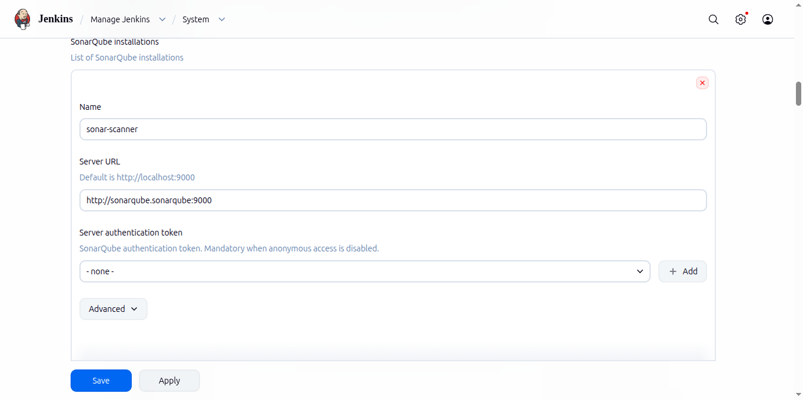
---
Configure HashiCorp Vault

Navigate to

```text
Manage Jenkins
→ System
→ HashiCorp Vault
```
Configure the following:

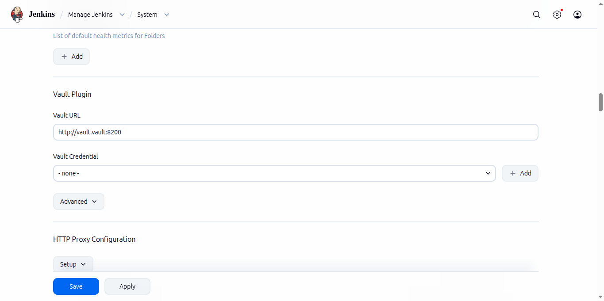

```bash
| Field             | Value                                              |
| ----------------- | -------------------------------------------------- |
| Vault URL         | (http://vault.vault:8200)                          |
| Credential        | vault-k8s                                          |
| KV Engine Version | 2                                                  |
```

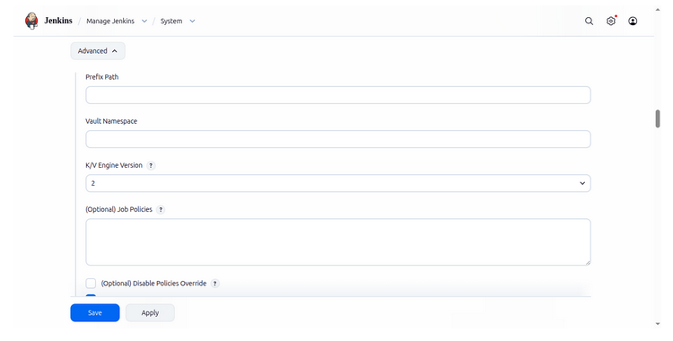

Create Vault Kubernetes Credential

Go to:

```text
Manage Jenkins
→ Credentials
→ System
→ Global credentials
→ Add Credentials
```

Configure:
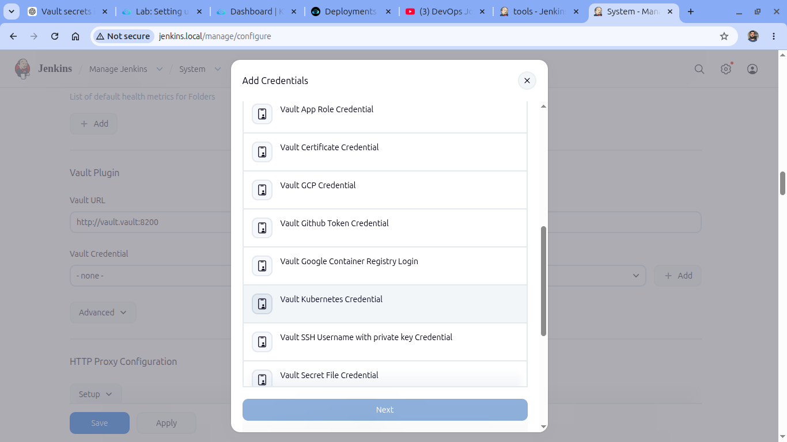

| Field      |          Value              |
|------------|-----------------------------|
| Kind       | Vault Kubernetes Credential |
| Role       | jenkins                     |
| Mount Path | kubernetes                  |
| ID         | vault-k8s                   |

Namespace field: Leave EMPTY.

The Vault Kubernetes credential allows Jenkins to authenticate using its Kubernetes ServiceAccount and retrieve secrets securely during pipeline execution.

Click Save.
---
☕ Configure Maven Global Settings

Navigate to

```text
Manage Jenkins
    ↓
Managed Files
```
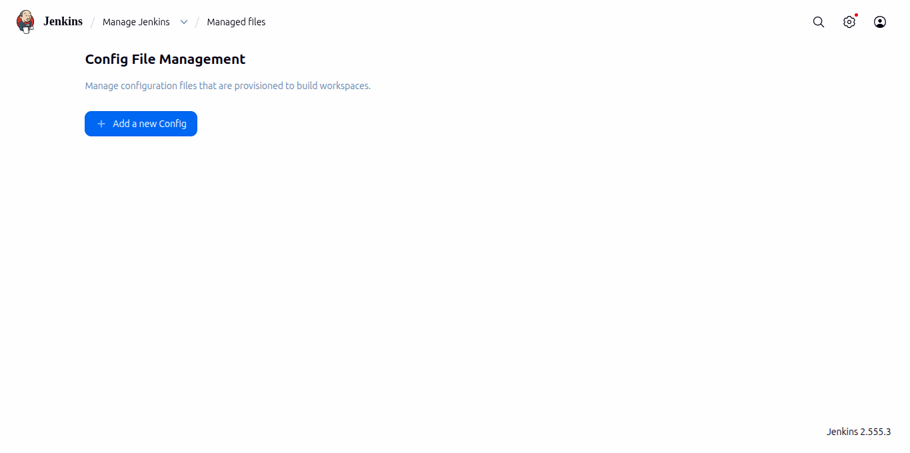

Create a new Global Maven settings.xml configuration.

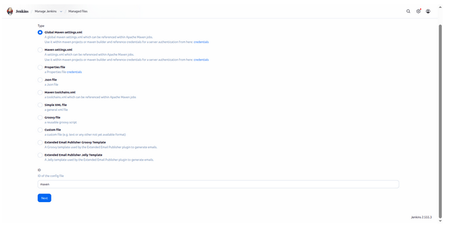

Upload or paste the customized settings.xml file containing the Nexus repository configuration.

Use the below snipet this cantians username and password as variables which created in the pipeline, at line no:120  sample snipet is commented by default uncomment and replace it with below.

```bash
	<server>
    <id></id>
      <id>maven-releases</id>
      <username>${NEXUS_USER}</username>
      <password>${NEXUS_PASS}</password>
    </server>

  <server>
     <id></id>
     <id>maven-snapshots</id>
     <username>${NEXUS_USER}</username>
     <password>${NEXUS_PASS}</password>
   </server>	
```
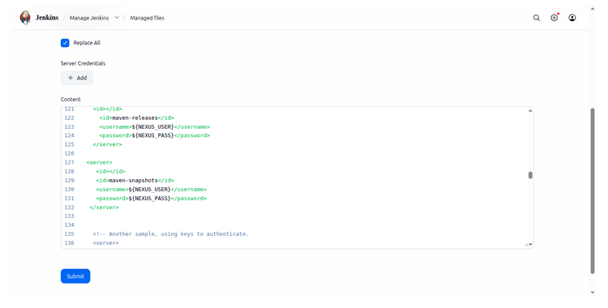

This allows Maven builds to download dependencies and publish artifacts directly to Nexus Repository Manager.
Click Submit.

make sure this below nexus Ulrs: same as in the image in POM.xml file 

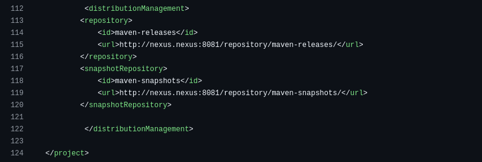

<url>http://nexus.nexus:8081/repository/maven-releases/</url>
<url>http://nexus.nexus:8081/repository/maven-snapshots/</url>

---

☸️ Configure Kubernetes Cloud

Jenkins uses the Kubernetes plugin to dynamically create ephemeral build agents for every pipeline execution.

Navigate to

```text
Manage Jenkins
    ↓
Clouds
    ↓
New Cloud
```
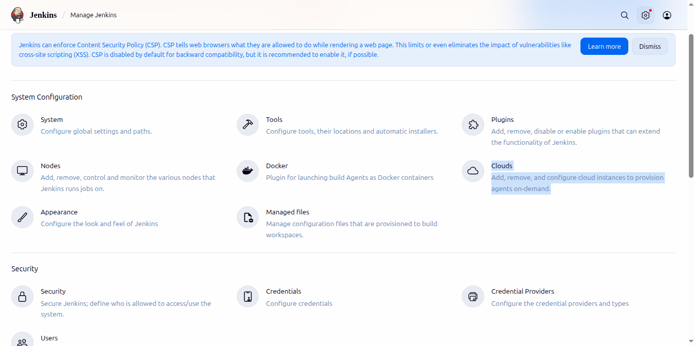

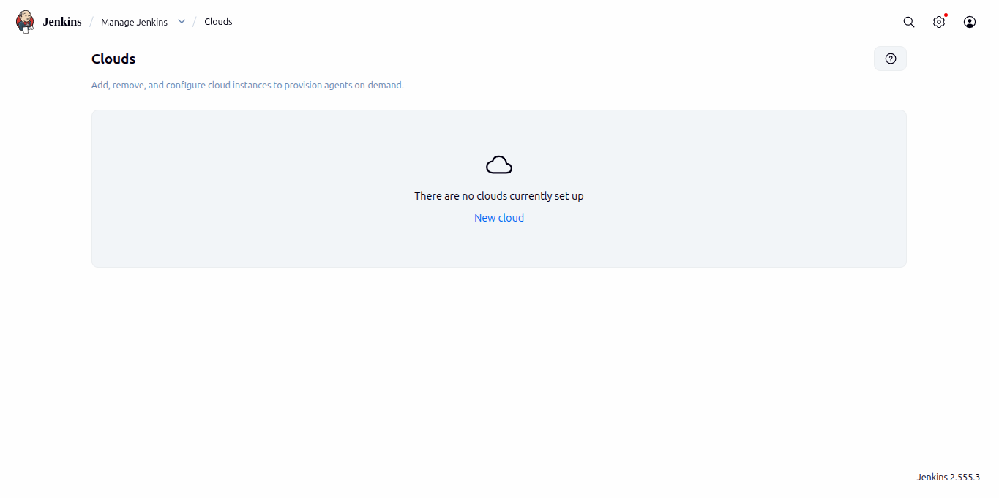

Select
```text
Kubernetes
```
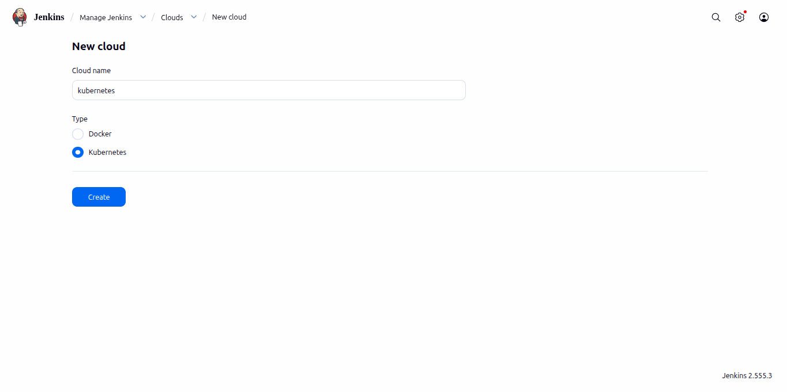

Configure the following.
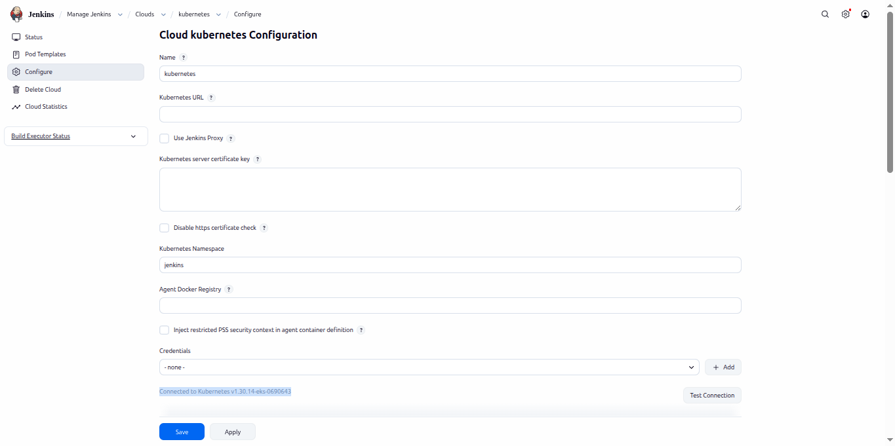
Click Test Connection.

You should see a successful connection message indicating Jenkins can communicate with the Kubernetes API.

```text
| Field                | Value                                                                                          |
| -------------------- | ---------------------------------------------------------------------------------------------- |
| Name                 | kubernetes                                                                                     |
| Kubernetes Namespace | jenkins                                                                                        |
| Jenkins URL          | (http://jenkins.jenkins.svc.cluster.local:8080) |
| Credentials          | Jenkins ServiceAccount                                                                         |
| WebSocket            | Enabled                                                                                      |
```
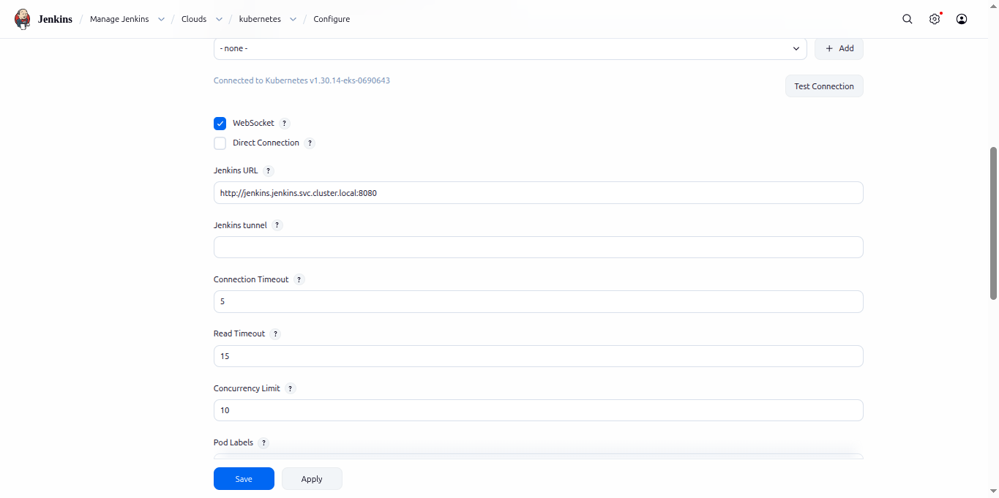

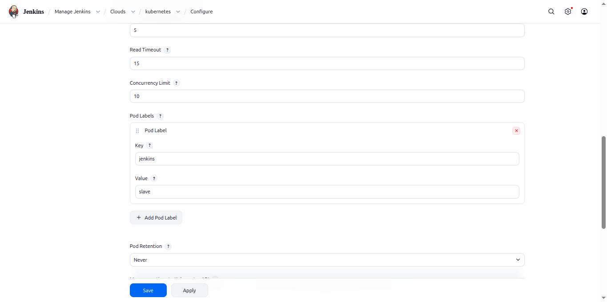

Create a Default Pod Template

Under the Kubernetes Cloud configuration:

```text
Pod Templates
    ↓
Add Pod Template
```
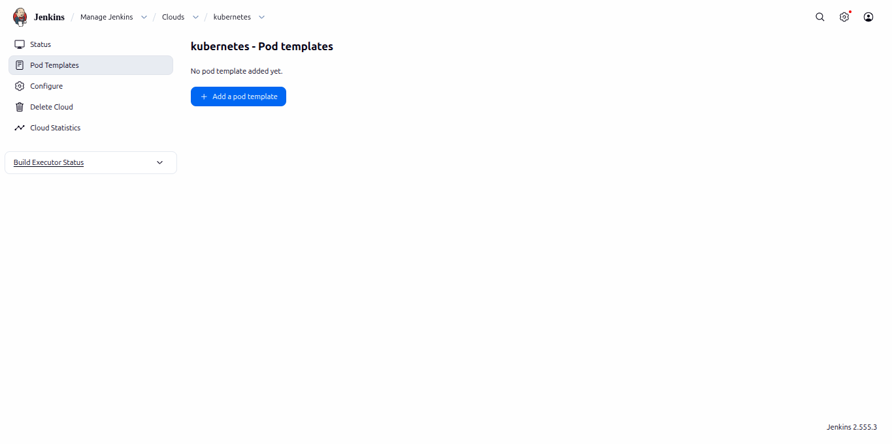

| Field             | Value                              |
| ----------------- | ---------------------------------- |
| Name              | agent                              |
| Namespace         | jenkins                            |
| Label             | agent01                            |
| Container Image   | jenkins/inbound-agent:latest-jdk21 |
| Command           | sleep                              |
| Arguments         | 9999999                            |
| Working Directory | /home/jenkins/agent                |
| Run As User       | 1000                               |
| Run As Group      | 1000                               |
| Workspace Volume  | EmptyDir 
                          |
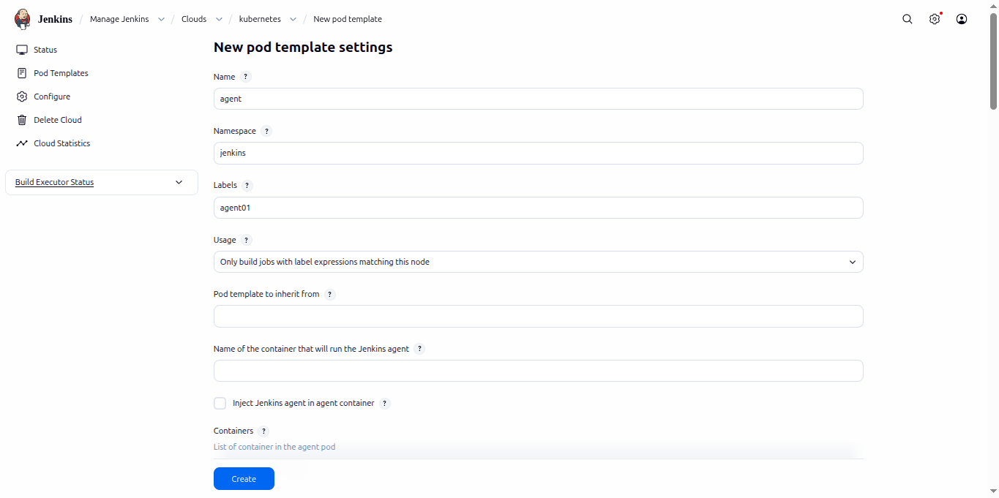
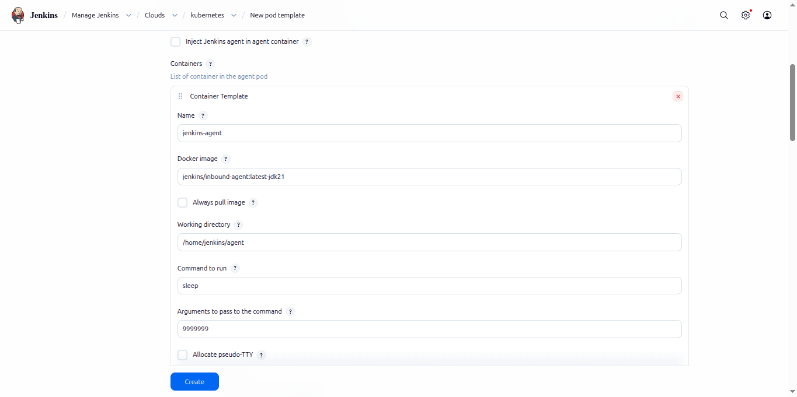
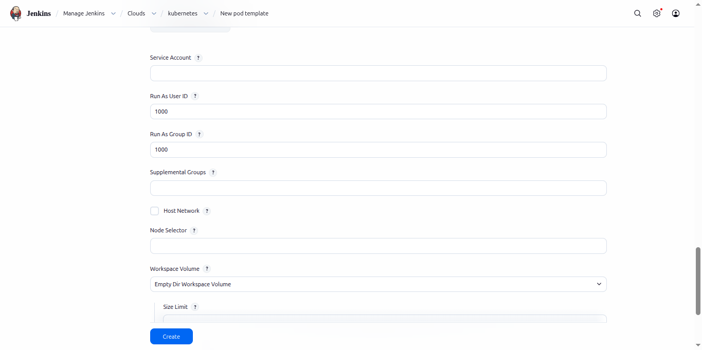

Click Create.

🧪 Validate the Kubernetes Cloud

Before building the real application, verify that Jenkins can provision Kubernetes agents successfully.
---
Create a simple pipeline that:

✅ Launches a Kubernetes agent
✅ Pulls the Git repository
✅ Executes Maven Test
✅ Executes Maven Compile

Using the below pipeline:
```bash
pipeline {

    agent {
        kubernetes {

            yaml '''
apiVersion: v1
kind: Pod

spec:
  containers:

  - name: maven
    image: maven:3.9.6-eclipse-temurin-17
    command:
    - cat
    tty: true
'''
        }
    }

    stages {

        stage('Git Checkout') {
            steps {
                git branch: 'main', url: "https://github.com/vinodk11/ci_mega_project.git"
            }
        }

        stage('Maven Test') {
            steps {
                container('maven') {
                    sh 'mvn test'
                }
            }
        }

        stage('Maven Compile') {
            steps {
                container('maven') {
                    sh 'mvn compile'
                }
            }
        }

    }
}

```

A successful build confirms that:

Jenkins Cloud configuration is correct
Dynamic Kubernetes agents are working
Maven container executes successfully
Jenkins can communicate with the Kubernetes cluster
---
🔐 Validate Vault Integration

Next, verify that Jenkins can authenticate with HashiCorp Vault and retrieve secrets.

Create a simple pipeline that:
Use the pipelin for testing VAULT that jenkins is Integrated and retrieve secrets from the VAULT.
```bash
pipeline {
    agent any

    stages {
        stage('Read Secret') {
            steps {
                withVault(
                    configuration: [
                        vaultUrl: 'http://vault.vault:8200',
                        vaultCredentialId: 'vault-k8s',
                        engineVersion: 2
                    ],
                    vaultSecrets: [[
                        path: 'secret/jenkins',
                        secretValues: [
                            [vaultKey: 'username', envVar: 'USERNAME'],
                            [vaultKey: 'password', envVar: 'PASSWORD']
                        ]
                    ]]
                ) {
                    sh '''
                    if [ -n "$USERNAME" ]; then
                       echo "Username received from Vault"
                    fi

                    if [ -n "$PASSWORD" ]; then
                        echo "Password received from Vault"
                    fi
                    '''
                }
            }
        }
    }
}
```

Authenticates with Vault using the Kubernetes ServiceAccount
Reads a sample secret (for example, Docker Hub or Git credentials)
Prints a confirmation message (without exposing the secret values)

A successful execution confirms:

✅ Vault authentication is working
✅ Jenkins ServiceAccount is mapped correctly
✅ Vault policies are configured correctly
✅ Jenkins can securely consume secrets during pipeline execution
🚀 Configure the Application Build Pipeline

With all integrations verified, the environment is now ready for the complete CI/CD workflow.
---
Now let's build theApplication pipeline will perform the following stages:

🚀 Stage	Description:

📥 Checkout	Clone the application source code
🔐 Fetch Secrets	Retrieve Git, Docker Hub, SonarQube, and Nexus credentials from Vault
☕ Build	Compile the application using Maven
🧪 Test	Execute unit tests
🔍 SonarQube Scan	Perform static code analysis
📦 Package	Generate the application artifact
🛡️ Security Scan	Scan the application with Trivy
🐳 Docker Build	Build the container image
📤 Push Image	Push the image to Docker Hub
📦 Publish Artifact	Upload the artifact to Nexus Repository

---

From the **Jenkins Dashboard**:

📂 Create Pipeline **Application-Build-pipeline**
📂 Open **Application-Build-pipeline**
⚙️ Click **Configure**

# 🗂️ General Settings

Under **General**, enable:

* ✅ Discard old builds

Then configure **Log Rotation**:

| Setting                 | Value       |
| ----------------------- | ----------- |
| 🗓️ Days to keep builds | Leave Blank |
| 📦 Max builds to keep   | **3**       |

> 💡 **Why Log Rotation?**
>
> Log rotation automatically removes old build history, reducing disk usage and keeping Jenkins clean and efficient.

---

⚙️ Click **Configure**

# 🗂️ General Settings

Under **General**, enable:

* ✅ Discard old builds

Then configure **Log Rotation**:

| Setting                 | Value       |
| ----------------------- | ----------- |
| 🗓️ Days to keep builds | Leave Blank |
| 📦 Max builds to keep   | **3**       |

> 💡 **Why Log Rotation?**
>
> Log rotation automatically removes old build history, reducing disk usage and keeping Jenkins clean and efficient.

---

# 🔧 Pipeline Configuration

Scroll to the **Pipeline** section and configure the following:
Change the Definition dropdown to "pipeline script form SCM". 
 
| ⚙️ Field             | 📝 Value                       |
| -------------------- | ------------------------------ |
| Definition           | **Pipeline script from SCM**   |
| SCM                  | **Git**                        |
| Repository URL       | `<YOUR_GITHUB_REPOSITORY>`     |
| Credentials          | **None** *(Public Repository)* |
| Branch               | `*/main`                       |
| Script Path          | `Application/Jenkinsfile`            |
| Lightweight Checkout | ✅ Enabled                      |


After completing the configuration:

* 💾 Click **Apply**
* 💾 Click **Save**

---
🎉 At the end of this section, Jenkins will be fully configured to build applications using Kubernetes agents while securely retrieving all required credentials from HashiCorp Vault, completing the CI portion of the DevSecOps workflow. 
