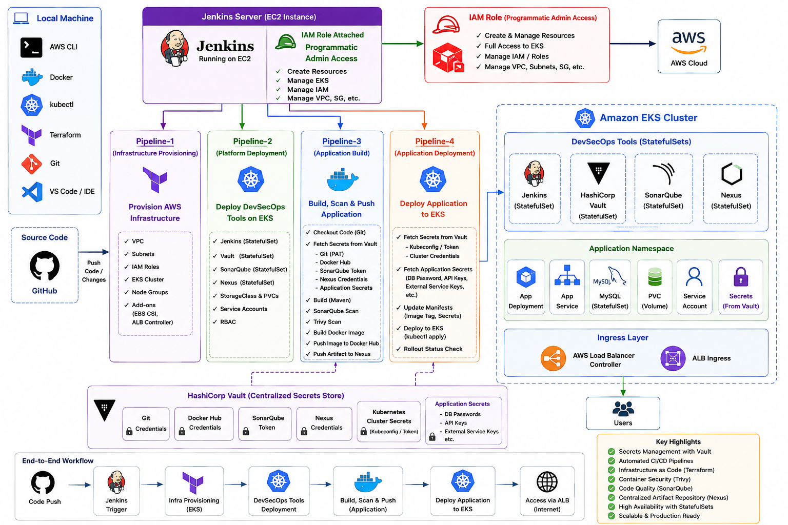

 # 🚀 End-to-End DevSecOps CI/CD Pipeline on AWS EKS

> A complete DevSecOps implementation that automates **Build → Scan → Secure → Deploy** using Jenkins, Vault, Kubernetes, and AWS.

---

## 📌 Workshop Overview

This project demonstrates how to build a secure and automated CI/CD pipeline on **Amazon EKS** while following DevSecOps best practices.

Instead of storing credentials inside Jenkins, **HashiCorp Vault** is used to securely manage secrets. Every code change automatically triggers a pipeline that builds, scans, pushes, updates Kubernetes manifests, and deploys the latest version to EKS.

---
## 📌 Architecture Flow:



## 🛠️ Tech Stack

| Category               | Tools                              |
| ---------------------- | ---------------------------------- |
| ☁️ Cloud               | AWS, Amazon EKS                    |
| ⚙️ CI/CD               | Jenkins                            |
| 🔐 Secrets             | HashiCorp Vault                    |
| 📦 Container           | Docker                             |
| ☸️ Orchestration       | Kubernetes                         |
| 🔍 Code Analysis       | SonarQube                          |
| 🛡️ Security Scan       | Trivy                              |
| 📚 Artifact Repository | Nexus Repository                   |
| 🚪 Ingress             | AWS Load Balancer Controller (ALB) |
| 📝 SCM                 | Git & GitHub                       |
---
## ✨ Key Features
* 🚀 Automated CI/CD Pipelines
* ☸️ Kubernetes Deployment on Amazon EKS
* 🔐 Dynamic Secret Management using Vault
* 🔍 Continuous Code Quality Analysis
* 🛡️ Container Vulnerability Scanning
* 🐳 Docker Image Automation
* 📦 Nexus Artifact Repository
* 🌐 ALB Ingress Configuration
* 📈 Production-style DevSecOps Workflow
---
## 📋 Prerequisites
| Requirement    | Description                     |
| -------------- | ------------------------------- |
| ☁️ AWS Account | For EKS and cloud resources     |
| 🐳 Docker      | Build container images          |
| ☸️ Kubernetes  | EKS Cluster                     |
| 🔧 kubectl     | Kubernetes CLI                  |
| 📦 Helm        | Install Kubernetes applications |
| 🏗️ Terraform   | Infrastructure provisioning     |
| 💻 Jenkins     | CI/CD Automation                |
| 🔐 Vault       | Secret Management               |
| 📚 GitHub      | Source Code Repository          |
---
## 🚀 End-to-End Workflow

```text
💻 Local Machine
        │
        ▼
1️⃣ Provision Jenkins EC2 Server (Terraform)
        │
        ▼
2️⃣ Jenkins provisions Amazon EKS
        │
        ▼
3️⃣ Jenkins deploys DevSecOps Platform
   ├── Jenkins (StatefulSet)
   ├── HashiCorp Vault
   ├── SonarQube
   └── Nexus Repository
        │
        ▼
4️⃣ Configure Jenkins Inside Kubernetes
        │
        ▼
5️⃣ Build Application
   ├── Checkout Source Code
   ├── Fetch Secrets from Vault
   ├── Maven Build
   ├── SonarQube Analysis
   ├── Trivy Scan
   ├── Docker Build
   └── Push Image
        │
        ▼
6️⃣ Deploy Application
   ├── Fetch Kubernetes Credentials from Vault
   ├── Deploy to Amazon EKS
   ├── Inject Application & Database Secrets
   └── Access through AWS Application Load Balancer
```
---
📚 Workshop Guide

This workshop is divided into **four sequential guides**, each building on the previous one. By the end of the workshop, you'll have a complete **End-to-End DevSecOps CI/CD Platform** running on Amazon EKS with secure secret management using HashiCorp Vault.


**1️⃣ [Jenkins Server Setup](jenkins_server/Jenkins_server_setup.md)**
Provision a Jenkins EC2 server on AWS using Terraform from your local machine. Instead of storing AWS Access Keys inside Jenkins, the EC2 instance uses an **IAM Role** to securely provision and manage AWS resources. Building the pipeline to provision the Amazon EKS cluster. 

**2️⃣ [DevSecOps Tools Setup](Tools/Tools_setup.md)** | Jenkins is deployed as a **StatefulSet** so its configuration, plugins, jobs, and pipeline history persist across pod restarts. HashiCorp Vault is deployed inside the Kubernetes cluster to provide a cloud-agnostic, centralized secrets management solution for Jenkins, Kubernetes workloads, and future multi-cloud environments. SonarQube and Nexus are also deployed to complete the platform. 

**3️⃣ [Application Build Pipeline](Application/App_build.md)** | Configure the Jenkins instance running inside Kubernetes to build applications using **dynamic Kubernetes agents**. Jenkins securely retrieves GitHub, Docker Hub, SonarQube, and Nexus credentials from HashiCorp Vault, performs code quality analysis, security scanning, Docker image creation, and publishes build artifacts as part of the CI pipeline. 

**4️⃣ [Application Deployment](deployment/App_Deploy.md)** | Configure secure application deployment using HashiCorp Vault and Kubernetes. Application and database secrets are dynamically injected into Pods through the **Vault Agent Injector**, while Jenkins (running as a StatefulSet on the EKS cluster) deploys the latest application version directly to Kubernetes without exposing sensitive credentials. 
---
## 🎯 What You'll Build

By following these four guides, you'll build a production-style DevSecOps platform that demonstrates:

- ☁️ Infrastructure provisioning with **Terraform**
- ☸️ Amazon **EKS** cluster automation
- 🧩 Jenkins running as a **StatefulSet** inside Kubernetes
- 🔐 Centralized secrets management using **HashiCorp Vault**
- 🔍 Continuous code quality analysis with **SonarQube**
- 📦 Artifact management using **Nexus Repository**
- 🛡️ Container security scanning with **Trivy**
- 🐳 Automated Docker image build and publishing
- 🚀 Secure application deployment to Kubernetes with **dynamic secret injection**
- 🌐 Application exposure using a shared **AWS Application Load Balancer (ALB)**
