# 🚀 Configure the Jenkins Pipeline to Deploy DevSecOps Tools

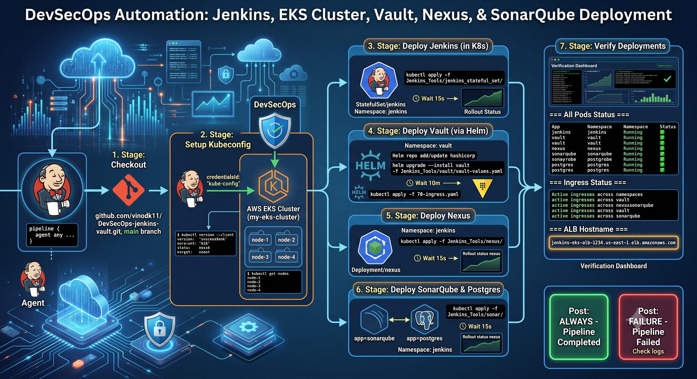

This pipeline automates the deployment of the complete **DevSecOps platform** on Amazon EKS.

## 🏗️ DevSecOps Components Deployed

| 🚀 Tool             | 📌 Purpose              |
| ------------------- | ----------------------- |
| 🧩 Jenkins          | CI/CD Automation Server |
| 🔍 SonarQube        | Static Code Analysis    |
| 📦 Nexus Repository | Artifact Repository     |
| 🔐 HashiCorp Vault  | Secrets Management      |

---
# 🔧 Add the Kubeconfig to jenkins server and check weather jenkins server is cummunicating with eks cluster 

```text
aws eks --region us-east-1 update-kubeconfig --name my-eks-cluster
Added new context arn:aws:eks:us-east-1:165772574557:cluster/my-eks-cluster to /home/ubuntu/.kube/config
ubuntu@ip-172-31-24-148:~$ kubectl get nodes 
NAME                            STATUS   ROLES    AGE     VERSION
ip-172-31-14-213.ec2.internal   Ready    <none>   5m50s   v1.30.14-eks-ecaa3a6
ip-172-31-43-51.ec2.internal    Ready    <none>   5m17s   v1.30.14-eks-ecaa3a6
ip-172-31-90-18.ec2.internal    Ready    <none>   5m51s   v1.30.14-eks-ecaa3a6
```
# 🔑 Create Jenkins Service Account
Before configuring the deployment pipeline, create a dedicated **Jenkins ServiceAccount** with the required Kubernetes permissions.
### 📄 What does this script do?
The **`jenkins-sa.sh`** script automatically creates:

* 📁 Jenkins Namespace
* 👤 Jenkins ServiceAccount
* 🔐 ClusterRole
* 🔗 ClusterRoleBinding
* 🎫 ServiceAccount Token

This enables Jenkins pipelines to securely communicate with the Kubernetes API and automate deployments without using personal Kubernetes credentials.

> [!NOTE]
> This configuration grants **cluster-admin** permissions to Jenkins, making it suitable for **learning, workshops, and lab environments**.
>
> For production environments, always follow the **Principle of Least Privilege (PoLP)** by granting only the permissions required.

### ▶️ Execute the Script

```bash
cd Tools

chmod +x jenkins-sa.sh

./jenkins-sa.sh
```

Expected as below 

```text
ubuntu@ip-172-31-24-148:~$ chmod u+x jenkins.sh 

ubuntu@ip-172-31-24-148:~$ ./jenkins.sh 
namespace/jenkins created
serviceaccount/jenkins created
clusterrole.rbac.authorization.k8s.io/jenkins-cluster-role created
clusterrolebinding.rbac.authorization.k8s.io/jenkins-cluster-role-binding created
Jenkins ServiceAccount created in namespace 'jenkins'
Token saved to jenkins_token.txt
```
---

📌 Add the Token to Jenkins Credentials

Grab the token from the path "jenkins-sa/jenkins_token.txt" which was create by the script: "jenkins.sh"  earlier.

```text
ubuntu@ip-172-31-24-148:~$ cat jenkins-sa/jenkins_token.txt
xxxxxxxxxxxxxxxxxxxxxxxxxxxxxxxxxxxxxxxxxxxxxxxxxxxxxxxxxxxxxxxxxxxxxxxxxxxxxxxxxxxxxxxxxxxxxxxxxxxxxxxxxxxxxxxxxxxxxxxxxxxxxxxxxxxxxxxxxxxxxxxxxxxxxxxxxxxxxxxxxxxxxxxxxxxxxxxxxxxxxxxxxxxxxxxxxxxxxxxxxxxxxxxxxxxxxxxxxxxxxxxxxxxxxxxxxxxxxxxxxxxxxxxxxxxxxxxxxxxxxxxxxxxxxxxxxxxxxxxxxxxxxxxxxxxxxxxxxxxxx
ip-172-31-24-148:~$ 
```
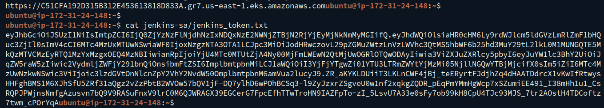

```text
Manage Jenkins
    ↓
Credentials
    ↓
System
    ↓
Global credentials (unrestricted)
    ↓
Add Credentials
```

```text
-----------------------------------------------------------
| Field       | Value                                     |
| ----------- | ----------------------------------------- |
| Kind        | **Secret text**                           |
| Scope       | **Global**                                |
| Secret text | *Paste the Jenkins ServiceAccount token*  |
| ID          | `kube-config`                             |
| Description | `Jenkins Kubernetes ServiceAccount Token` |
-----------------------------------------------------------
```
---

# ⚙️ Configure the Jenkins Pipeline

From the **Jenkins Dashboard**:

1. 📂 Open **tools-deployment-pipeline**
2. ⚙️ Click **Configure**

# 🗂️ General Settings

Under **General**, enable:

* ✅ Discard old builds

Then configure **Log Rotation**:

| Setting                 | Value       |
| ----------------------- | ----------- |
| 🗓️ Days to keep builds | Leave Blank |
| 📦 Max builds to keep   | **3**       |

> 💡 **Why Log Rotation?**
>
> Log rotation automatically removes old build history, reducing disk usage and keeping Jenkins clean and efficient.
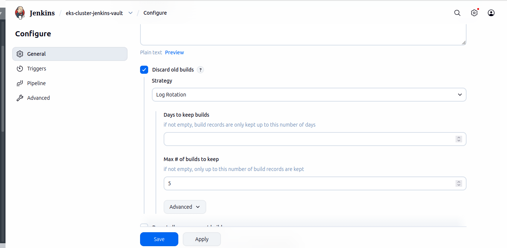
---

# 🔧 Pipeline Configuration
Scroll to the **Pipeline** section and configure the following:
Change the Definition dropdown to "pipeline script form SCM". 
 
| ⚙️ Field             | 📝 Value                       |
| -------------------- | ------------------------------ |
| Definition           | **Pipeline script from SCM**   |
| SCM                  | **Git**                        |
| Repository URL       | `<YOUR_GITHUB_REPOSITORY>`     |
| Credentials          | **None** *(Public Repository)* |
| Branch               | `*/main`                       |
| Script Path          | `tools/Jenkinsfile`            |
| Lightweight Checkout | ✅ Enabled                     |

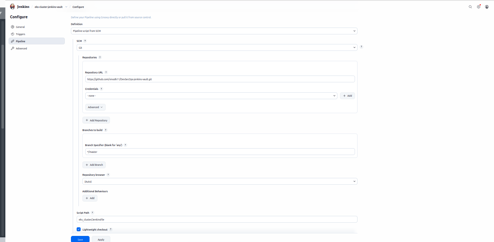

After completing the configuration:

* 💾 Click **Apply**
* 💾 Click **Save**

> [!NOTE]
Edit pipeline as shown in the below add your <your server ulr>: in all the stages.

```text
stage('Setup Kubeconfig') {
            steps {
                withKubeCredentials(
                    kubectlCredentials: [
                        [
                            caCertificate: '',
                            clusterName: 'my-eks-cluster',
                            contextName: 'jenkins-context',
                            credentialsId: 'kube-config',
                            namespace: 'jenkins',
                            serverUrl: '<you-server-Ulr>'
                        ]
                    ]
                ) {
                    sh 'kubectl version --client'
                    sh 'kubectl get nodes'
                }
            }
        }

```
---

# 🚀 Trigger the Pipeline

After saving the pipeline:

1. Open the pipeline dashboard.
2. Click **▶️ Build Now**

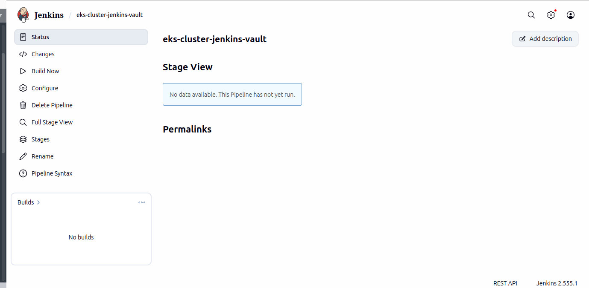
Jenkins immediately starts the deployment.

Since this is a **standard pipeline**, no parameters are required.

---

# 📊 Monitor the Pipeline

Navigate to **Stage View** to monitor the deployment.

Each completed stage turns **🟢 Green**, indicating successful execution.

| 🚀 Stage                  | 📋 Description                                                       |
| ------------------------- | -------------------------------------------------------------------- |
| 📥 Checkout SCM           | Downloads the Kubernetes manifests and Jenkins pipeline from GitHub. |
| ☸️ Deploy Jenkins         | Deploys Jenkins as a StatefulSet on Amazon EKS.                      |
| 🔍 Deploy SonarQube       | Deploys SonarQube for code quality analysis.                         |
| 📦 Deploy Nexus           | Deploys Nexus Repository Manager for artifact storage.               |
| 🔐 Deploy HashiCorp Vault | Deploys Vault for centralized secrets management.                    |
| 🧹 Post Actions           | Cleans the Jenkins workspace and displays the deployment result.     |

---

# ✅ Deployment Complete

After all stages complete successfully, your DevSecOps platform will be available on Amazon EKS.

### 🎉 Components Running

* ✅ Jenkins
* ✅ SonarQube
* ✅ Nexus Repository
* ✅ HashiCorp Vault

Your environment is now ready for building secure CI/CD pipelines and deploying applications.

---

# ✅ Verify the DevSecOps Platform Deployment

After the deployment pipeline completes successfully, verify that all DevSecOps components have been deployed correctly before proceeding with the application pipelines.

---

# 🔍 Step 1: Verify the Deployments

Confirm that all pods, services, and workloads are running successfully.

### 🧩 Jenkins

```bash
kubectl get all -n jenkins
```

Expected Output

* ✅ Jenkins Pod is **Running**
* ✅ Jenkins Service is created
* ✅ Jenkins StatefulSet is **Ready (1/1)**
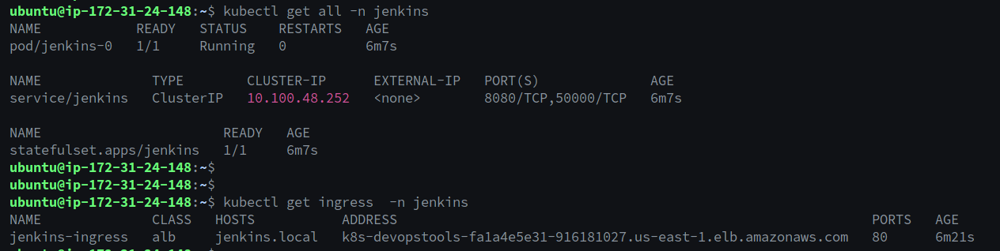
---

### 🔐 HashiCorp Vault

```bash
kubectl get all -n vault
```

Expected Output

* ✅ Vault StatefulSet is created
* ✅ Vault Agent Injector Pods are running
* ✅ Vault Services are available

> **Note**
>
> During the initial deployment, the Vault pods will show **0/1 Ready** because Vault has not yet been initialized and unsealed. This is expected behavior and will be completed in the next section.
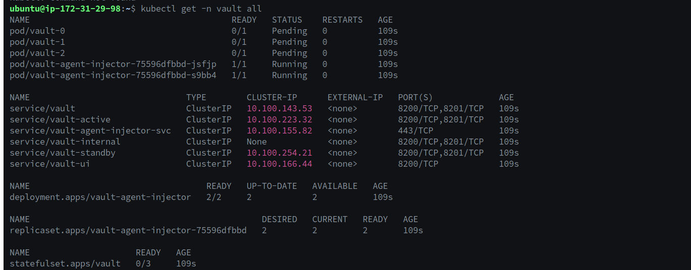
---

### 🔍 SonarQube

```bash
kubectl get all -n sonarqube
```

Expected Output

* ✅ SonarQube Pod is Running
* ✅ PostgreSQL Pod is Running
* ✅ Services are available
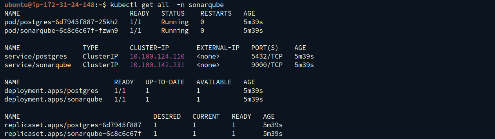
---

### 📦 Nexus Repository

```bash
kubectl get all -n nexus
```

Expected Output

* ✅ Nexus Pod is Running
* ✅ Nexus Service is available
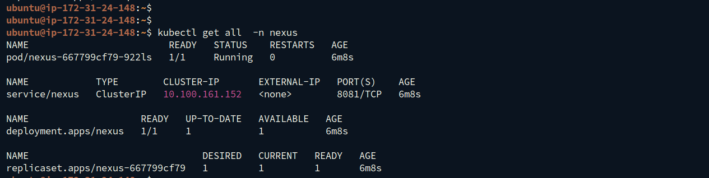
---

# 🌐 Step 2: Verify the Ingress Resources

Since all DevSecOps tools share a **single AWS Application Load Balancer (ALB)**, verify that the Ingress resources have been created successfully.

```bash
kubectl get ingress -A
```

Expected Output
-------------------------------
| Namespace | Host            |
| --------- | --------------- |
| jenkins   | jenkins.local   |
| vault     | vault.local     |
| sonarqube | sonarqube.local |
| nexus     | nexus.local     |
-------------------------------
Each Ingress should display the **same ALB DNS name**, confirming that the AWS Load Balancer Controller has grouped them into a single ALB.

---

# 🌍 Step 3: Resolve the ALB DNS

Retrieve the ALB DNS name from any Ingress.

```bash
kubectl get ingress -n jenkins
```
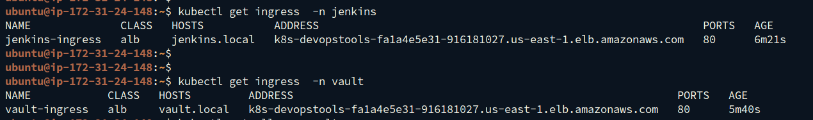
Example:

```text
k8s-devopstools-fa1a4e5e31-916181027.us-east-1.elb.amazonaws.com
```

Resolve the DNS name to its public IP.

```bash
nslookup k8s-devopstools-fa1a4e5e31-916181027.us-east-1.elb.amazonaws.com
```

Example Output

```text
50.16.xxx.xxx
```
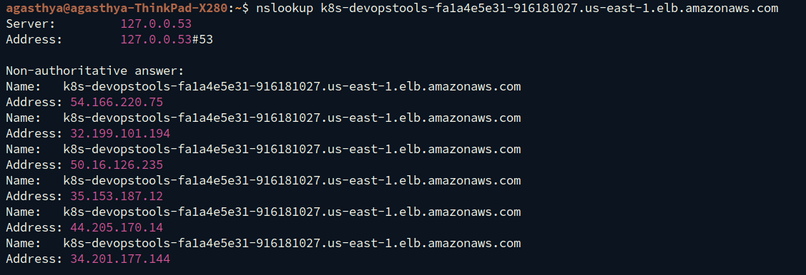
---

# 🖥️ Step 4: Update the Hosts File

Map the ALB IP address to each local hostname.

### Linux / macOS

Edit:

```bash
sudo vi /etc/hosts
```

Add the following entries:

```text
50.16.xxx.xxx    jenkins.local
50.16.xxx.xxx    vault.local
50.16.xxx.xxx    sonarqube.local
50.16.xxx.xxx    nexus.local

```
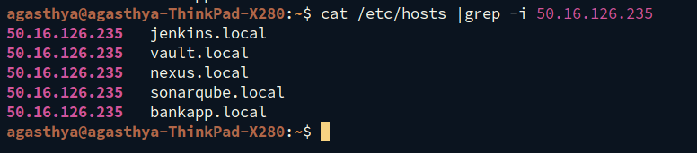

Save the file.

---

# 🚀 Step 5: Access the DevSecOps Platform

Open the following URLs in your browser.

| Tool         | URL                    |
| ------------ | ---------------------- |
| 🧩 Jenkins   | http://jenkins.local   |
| 🔐 Vault     | http://vault.local     |
| 🔍 SonarQube | http://sonarqube.local |
| 📦 Nexus     | http://nexus.local     |

---

# 🔑 Step 6: Unlock Jenkins

Retrieve the initial administrator password.

```bash
kubectl exec -it jenkins-0 -n jenkins -- \
cat /var/jenkins_home/secrets/initialAdminPassword
```
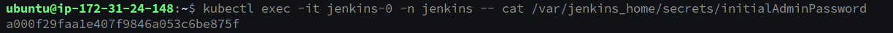

Copy the generated password.

Open your browser and navigate to:

```text
http://jenkins.local
```
Paste the password and click **Continue**.

Clik on the Suggested Plugins and Continue to

👤 Create the First Administrator User

Provide the following details:
-------------------------------------------------------
| Field     | Value                                   |
| --------- | --------------------------------------- |
| Username  | admin                                   |
| Password  | ********                                |
| Full Name | Your Name                               |
| Email     | [your@email.com](mailto:your@email.com) |
-------------------------------------------------------

For now let  be and will configure the remaining part befor deploying the Application.

# 🔧 Configure SonarQube & Nexus Repository

After verifying that all DevSecOps tools are running successfully, configure **SonarQube** and **Nexus Repository** before using them in the CI/CD pipelines.

---

# 🔍 Configure SonarQube

## Step 1: Access SonarQube

Open your browser and navigate to:

```text
http://sonarqube.local
```

---

## Step 2: Login

Use the default credentials:

| Username | Password |
| -------- | -------- |
| `admin`  | `admin`  |

On your first login, SonarQube prompts you to change the default administrator password.

Choose a strong password and click **Update Credentials**.
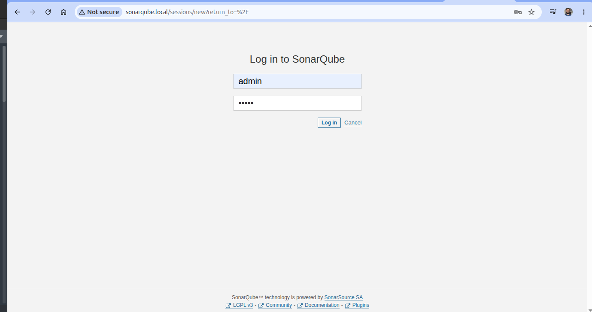
---

## Step 3: Generate a User Token

This token will allow Jenkins to authenticate with SonarQube during code analysis.

Navigate to:

**Administration → Security → Users**

Click the **Tokens** icon for the **admin** user.
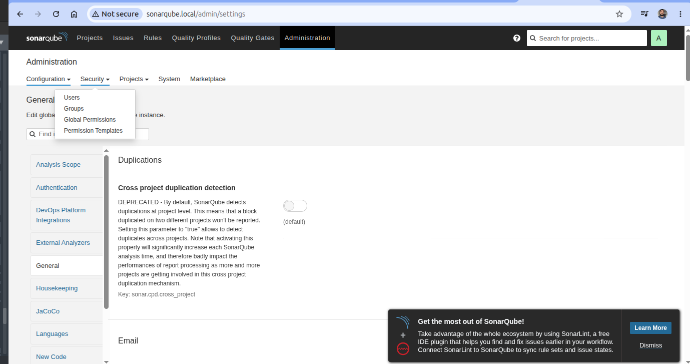

Enter:
```text
| Field      | Value           |
| ---------- | --------------- |
| Token Name | `jenkins-token` |
```
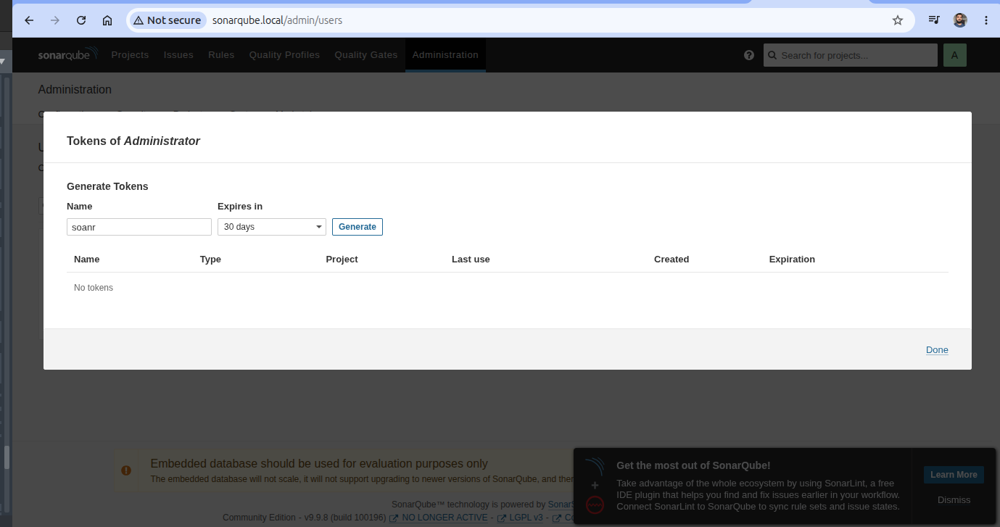
Click **Generate**.
> ⚠️ **Important**
> Copy the generated token immediately. SonarQube displays it only once.
Example:

```text
sqp_XXXXXXXXXXXXXXXXXXXXXXXXXXXXXXXXXXXXXXXX
```
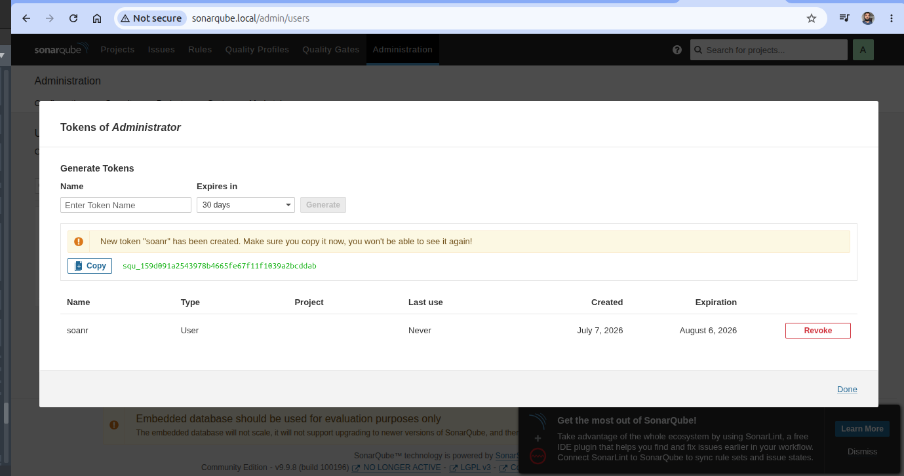
Store this token securely. It will be added to **HashiCorp Vault** in a later step.
---
# 📦 Configure Nexus Repository
## Step 1: Access Nexus
Open:

```text
http://nexus.local
```
---
## Step 2: Retrieve the Initial Admin Password

Run the following command:

```bash
kubectl exec -it deployment/nexus -n nexus -- \
cat /nexus-data/admin.password
```
Example Output

```text
3d4c7f18-xxxx-xxxx-xxxxx-xxxxxxxxxxxx
```
Copy the password.
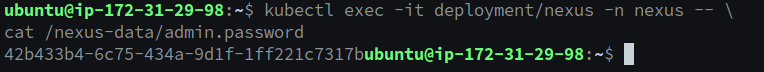
---

## Step 3: Login

Use:

| Username | Password         |
| -------- | ---------------- |
| `admin`  | Initial Password |

---

## Step 4: Change the Administrator Password

After logging in, Nexus prompts you to update the administrator password.

1. Enter the initial password.
2. Enter a new password.
3. Confirm the new password.
4. Click **Next**.
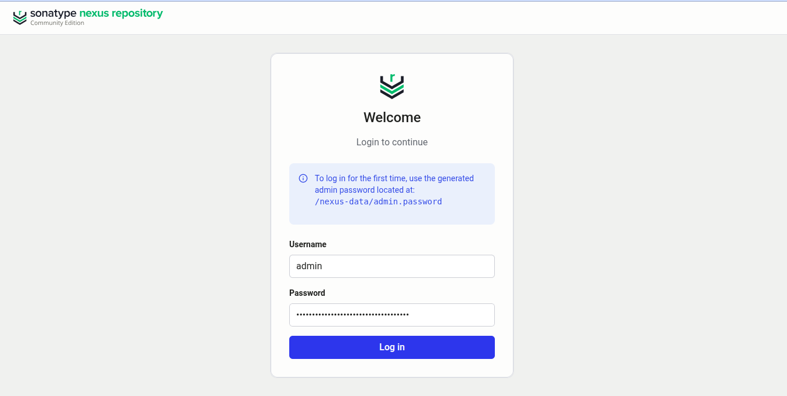
---

## Step 5: Disable Anonymous Access (Recommended)

When prompted:

Select

```
Disable anonymous access
```

Click **Finish**.

This prevents unauthenticated users from accessing your Nexus repositories.

---

## 🔐 Configure HashiCorp Vault

After deploying Vault, initialize and configure it for Kubernetes authentication and centralized secrets management.

In this workshop, Vault is used to securely store and manage:

- 🔑 GitHub Credentials
- 🐳 Docker Hub Credentials
- 🔍 SonarQube Token
- 📦 Nexus Credentials
- ☸️ Kubernetes API Credentials
- 🗄️ Application Secrets
- 🛢️ Database Secrets

Jenkins retrieves these secrets dynamically during pipeline execution, eliminating the need to hardcode sensitive information.
---

# Step-1. Initialize Vault (RUN ONLY ONCE)

```bash
kubectl exec -it vault-0 -n vault -- vault operator init
```
This generates FIve keys and a ROOT Token:
use any three keys and unseal vault.
Example:

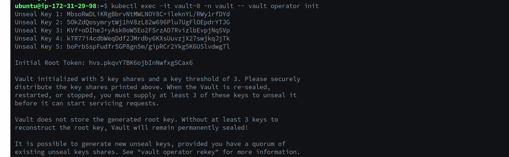

```text
Unseal Key 1: xxxxxxxxxxxxxxxxxxxxxxxxxxxxxxxxxxxxxxxxxxx
Unseal Key 2: xxxxxxxxxxxxxxxxxxxxxxxxxxxxxxxxxxxxxxxxxxx
Unseal Key 3: xxxxxxxxxxxxxxxxxxxxxxxxxxxxxxxxxxxxxxxxxxx
Unseal Key 4: xxxxxxxxxxxxxxxxxxxxxxxxxxxxxxxxxxxxxxxxxxx
Unseal Key 5: xxxxxxxxxxxxxxxxxxxxxxxxxxxxxxxxxxxxxxxxxxx

Initial Root Token: xxxxxxxxxxxxxxxxxxxxxxxxxxxxxxxxxxxxxx
```
Store them safely.
---
# Step-2. Unseal Vault Pods
## Unseal vault-0

```bash
kubectl exec -n vault -it vault-0 -- vault operator unseal <KEY_1>
kubectl exec -n vault -it vault-0 -- vault operator unseal <KEY_2>
kubectl exec -n vault -it vault-0 -- vault operator unseal <KEY_3>
```
After unleasing vault-0 with all three keys you will able see to as the below 

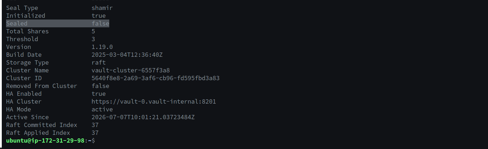
---
## Unseal vault-1

```bash
kubectl exec -n vault -it vault-1 -- vault operator unseal <KEY_1>
kubectl exec -n vault -it vault-1 -- vault operator unseal <KEY_2>
kubectl exec -n vault -it vault-1 -- vault operator unseal <KEY_3>
```
---
## Unseal vault-2

```bash
kubectl exec -n vault -it vault-2 -- vault operator unseal <KEY_1>
kubectl exec -n vault -it vault-2 -- vault operator unseal <KEY_2>
kubectl exec -n vault -it vault-2 -- vault operator unseal <KEY_3>
```
---
# Step-3. Verify Vault HA Cluster

```bash
kubectl exec -n vault -it vault-0 -- vault operator raft list-peers
```
Expected:

```text
vault-0   leader
vault-1   follower
vault-2   follower
```
---
# Step-4. Login to Vault
```bash
kubectl exec -n vault -it vault-0 -- vault login <ROOT_TOKEN>
```
---
# Step-5. Verify Authentication Methods
```bash
kubectl exec -n vault -it vault-0 -- vault auth list
```
---
# Step-6. Enable Kubernetes Authentication
```bash
kubectl exec -n vault -it vault-0 -- vault auth enable kubernetes
```
If already enabled, ignore the error.
---
#Configure Kubernetes Authentication Backend
Vault needs:
- Kubernetes API endpoint
- Kubernetes CA certificate
- Token reviewer JWT
This allows Vault to validate Kubernetes service account tokens.
---
## Get Kubernetes API Server
```bash
KUBE_HOST=$(kubectl config view --raw --minify --flatten -o jsonpath="{.clusters[0].cluster.server}")
```
---
## Get Token Reviewer JWT
```bash
TOKEN_REVIEW_JWT=$(kubectl exec -n vault vault-0 -- cat /var/run/secrets/kubernetes.io/serviceaccount/token)
```
---
## Get Kubernetes CA Certificate
```bash
KUBE_CA_CERT=$(kubectl exec -n vault vault-0 -- cat /var/run/secrets/kubernetes.io/serviceaccount/ca.crt)
```
---
## Configure Vault Kubernetes Authentication
```bash
kubectl exec -i -n vault vault-0 -- vault write auth/kubernetes/config \
  token_reviewer_jwt="$TOKEN_REVIEW_JWT" \
  kubernetes_host="$KUBE_HOST" \
  kubernetes_ca_cert="$KUBE_CA_CERT"
```
---
# Step-7. Verify Kubernetes Auth Configuration
```bash
kubectl exec -n vault -it vault-0 -- vault read auth/kubernetes/config
```
IMPORTANT:
You should see:
```text
token_reviewer_jwt_set    true
```
---
# Step-8. Enable KV Version 2 Secrets Engine
Vault stores all CI/CD and application secrets in a KV Version 2 secrets engine.
If this is a fresh Vault installation, enable the KV v2 engine using the following command.

```bash
kubectl exec -n vault -it vault-0 -- vault secrets enable -path=secret kv-v2
```
Below secrets are created to test within a test pipeline wether jenkins is retrieving serets or not
```bash
kubectl exec -n vault -it vault-0 -- vault kv put secret/jenkins \
  username=admin \
  password=SuperSecret123
```
 

```bash
kubectl exec -n vault -it vault-0 sh

vault kv put secret/dockerhub username=<username>  password=<your-password>
vault kv put secret/sonarqube token=<your-sonarqube-token>
vault kv put secret/nexus username=admin password=<your-password>
vault kv put secret/git username=<username> password=<your git token>
```
---
Now create secrets for the Cluster to Build and Deploy:
```bash
kubectl config view --minify -o jsonpath='{.clusters[0].cluster.server}'
```
Cluster ulr expected like: https://C51CFA192D315B312E453613818D833A.gr7.us-east-1.eks.amazonaws.com  
---
```bash
kubectl config view --raw --minify \
-o jsonpath='{.clusters[0].cluster.certificate-authority-data}' \
| base64 -d > ca.crt

kubectl exec -n vault -it vault-0 -- \
vault kv put secret/ks8 \
token="$(cat jenkins-sa/jenkins_token.txt)" \
server="https://C51CFA192D315B312E453613818D833A.gr7.us-east-1.eks.amazonaws.com" \
ca.crt="$(cat ca.crt)"

kubectl exec -n vault -it vault-0 -- \
vault kv get secret/kS8
```
# Step-9. Create the policy and copy  

```bash
cat <<EOF > jenkins-policy.hcl
path "secret/data/jenkins" {
  capabilities = ["read"]
}

path "secret/metadata/jenkins" {
  capabilities = ["read", "list"]
}

path "secret/data/dockerhub" {
  capabilities = ["read"]
}

path "secret/metadata/dockerhub" {
  capabilities = ["read", "list"]
}

path "secret/data/sonarqube" {
  capabilities = ["read"]
}

path "secret/metadata/sonarqube" {
  capabilities = ["read", "list"]
}

path "secret/data/nexus" {
  capabilities = ["read"]
}

path "secret/metadata/nexus" {
  capabilities = ["read", "list"]
}

path "secret/data/git" {
  capabilities = ["read"]
}

path "secret/metadata/git" {
  capabilities = ["read", "list"]
}

path "secret/data/ks8" {
  capabilities = ["read"]
}

path "secret/metadata/ks8" {
  capabilities = ["read", "list"]
}
EOF
```
```bash
kubectl cp jenkins-policy.hcl vault/vault-0:/tmp/

kubectl exec -n vault -it vault-0 -- \
vault policy write jenkins-policy /tmp/jenkins-policy.hcl
```
# Step-10. Create Jenkins Kubernetes Role

```bash
kubectl exec -n vault -it vault-0 -- vault write auth/kubernetes/role/jenkins \
  bound_service_account_names=jenkins \
  bound_service_account_namespaces=jenkins \
  policies=jenkins-policy \
  ttl=24h
```

# Step-11. Verify Jenkins Role

```bash
kubectl exec -n vault -it vault-0 -- vault read auth/kubernetes/role/jenkins
```

Verify Jenkins Service Account

```bash
kubectl describe pod jenkins-0 -n jenkins | grep -i "Service Account"
```
Expected:

```text
Service Account: jenkins
```

At this stage What Configurations is we have completed is:


✅ Jenkins Kubernetes role created
✅ Jenkins ServiceAccount verified
✅ SonarQube Administrator Account
✅ SonarQube User Token
✅ Nexus Administrator Password
✅ Vault initialized
✅ Vault unsealed
✅ HA cluster healthy
✅ Kubernetes authentication enabled
✅ KV v2 secrets engine enabled
✅ All required secrets stored
✅ Jenkins policy created

Vault is now fully configured and ready to provide secrets securely to the Jenkins pipelines.