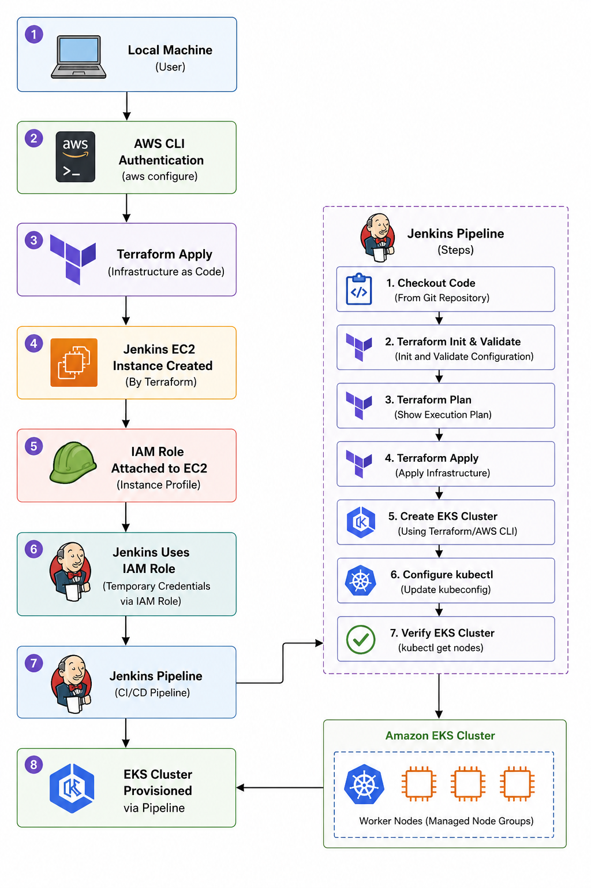
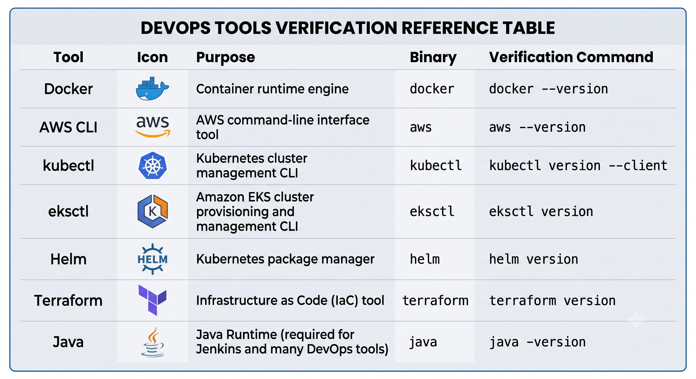
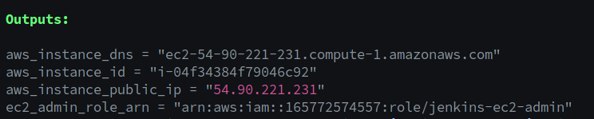
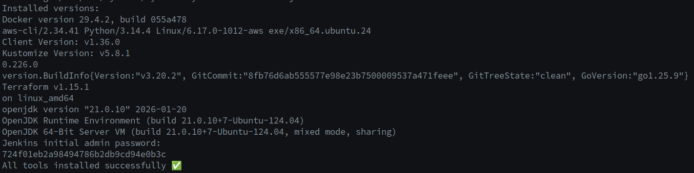
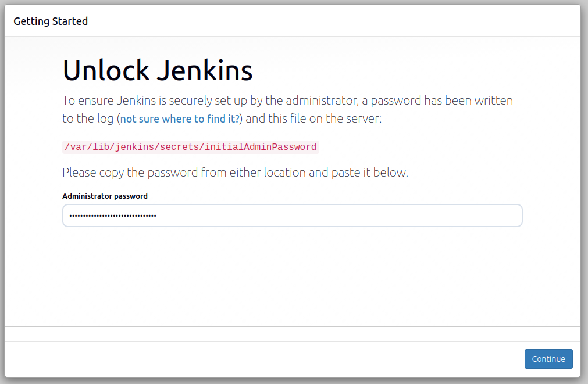
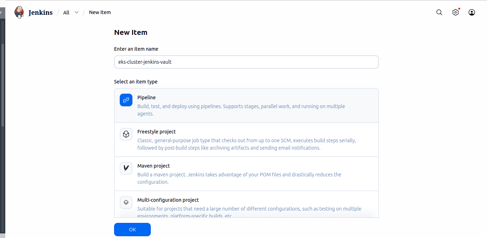
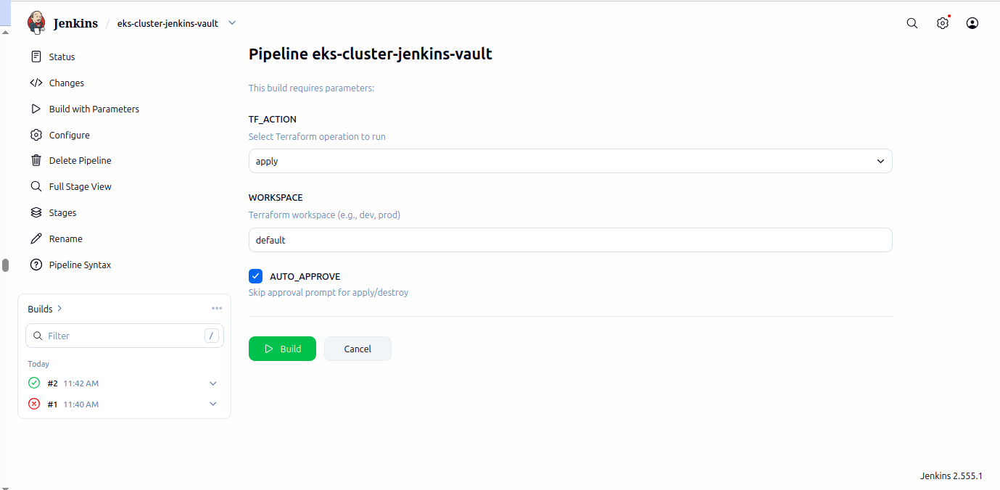
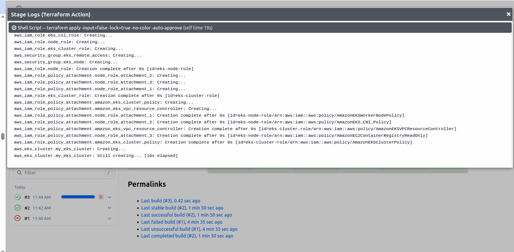
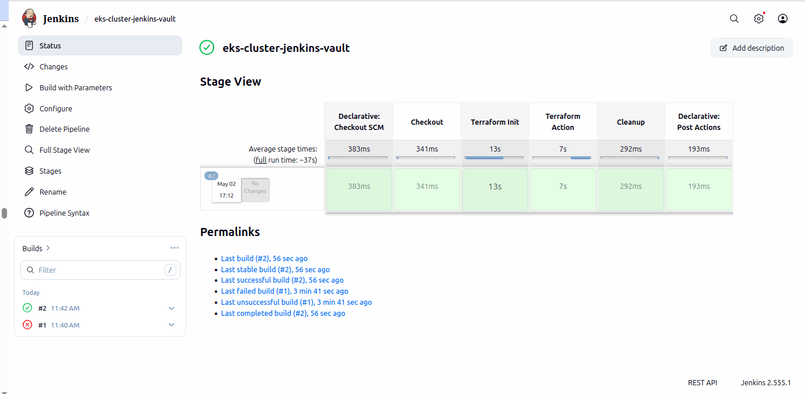

# Deploying Jenkins Server on AWS Using Terraform from GitHub Repository

# Overview:

This guide explains how to provision a Jenkins EC2 server on AWS using Terraform from your local machine. Once the Jenkins server is created, an IAM Role attached to the EC2 instance will provide AWS permissions, eliminating the need to store AWS Access Keys on the Jenkins server.

---
# Architecture Flow


---

# Prerequisites

Before starting, ensure you have:

* AWS Account
* Git Installed
* Terraform Installed
* AWS CLI Installed
* GitHub Repository 
* IAM User with Programmatic Access (for initial provisioning only)
---
An automated bootstrapping script(install_tools_script.sh) install and configure all the required ecosystem tools.

Required Tools:


---
# Step 1: Create IAM User for Initial Provisioning

Navigate to:

AWS Console → IAM → Users → Create User

### User Name

```text
terraform-admin
```

### Permissions

Attach:

```text
AdministratorAccess
```

> This user will only be used from your local machine to provision infrastructure.
---
# Step 2: Generate Programmatic Access Credentials
Open:

```text
IAM → Users → terraform-admin → Security Credentials
```
Create Access Key.
Save:

```text
AWS_ACCESS_KEY_ID
AWS_SECRET_ACCESS_KEY
```
---
# Step 3: Configure AWS CLI

```bash
aws configure
```
Provide:

```text
AWS Access Key ID
AWS Secret Access Key
Region (Example: us-east-1)
Output Format (json)
```
---
# Step 4: Clone GitHub Repository

Create your own GitHub repository, fork or clone this https://github.com/AgasthyaGoud/Vault_Jenkins_integration.git repository locally, and push the project to your newly created repository.  

```bash
git clone https://github.com/AgasthyaGoud/Vault_Jenkins_integration.git

cd repository
```
Example:

```bash
git clone https://github.com/AgasthyaGoud/Vault_Jenkins_integration.git

cd jenkins_server
```


---
# Step 5: Review Terraform Variables

Open:

```text
Variables.tf
```
Example:

```hcl
region = "us-east-1"

instance_type = "t3.large"

key_name = "<your kay name>"
```

> [!NOTE]

Before getting started, configure the Terraform remote backend by creating an S3 bucket and a DynamoDB table for state locking. Run the backend.sh script to provision these resources.

```bash
cd jenkins_server 
chmod +u backend.sh
./backend.sh  <your backet name>  <region>
```

OPen:
```text
provide.tf file in the eks_cluster folder add your backet name which you created earlier using backen.sh script
```
example:

```hcl
backend "s3" {
    bucket         = "<your backet name>" 
    key            = "eks-cluster/terraform.tfstate"
    region         = "us-east-1"
    dynamodb_table = "terraform-state-lock"
    encrypt        = true
  }
```  

Push change to git hub 

```bash
git .
git commit -m "added bucket  name in the provider.tf"
git psuh
```

Modify values as required.
---
# Step 6: Initialize Terraform

```bash
terraform init
```
Terraform downloads required providers.
Expected:

```text
Terraform has been successfully initialized
```
---
# Step 7: Validate Terraform Code

```bash
terraform validate
```

Expected:

```text
Success! The configuration is valid.
```
---
# Step 8: Review Infrastructure Plan

```bash
terraform plan
```
Review resources:

* EC2 Instance
* Security Groups
* IAM Instance Profile
* IAM Role
* EBS Volumes
* Elastic IP (if configured)
---
# Step 9: Create Jenkins Server

```bash
terraform apply -auto-approve
```
Terraform provisions:

* Jenkins EC2 Server
* Security Group
* IAM Role
* Instance Profile
* EBS Storage
---
# Step 10: Obtain Jenkins Server Public IP

```bash
terraform output
```

Example:


---
# Step 11: Connect to Jenkins Server

```bash
ssh -i devsecops-key.pem ubuntu@<public-ip>
```
Example:

```bash
ssh -i devsecops-key.pem ubuntu@54.xx.xx.xx
```
---
# Step 12: Verify IAM Role Attachment

No AWS access keys are required on Jenkins.

Verify attached role:

```bash
aws sts get-caller-identity
```
Expected:

```text
arn:aws:sts::<account-id>:assumed-role/JenkinsAdminRole/i-xxxxxxxx
```
This confirms Jenkins is using the EC2 IAM Role.
---
# Step 13: Verify Tool Installation and fetching jenkins intial password

```bash
tail -f  /var/log/user-data.log
```

---
# Step 14: Now configure the pielpeine to provision EKS cluster
Complete the intail setup of jenkins 
Grab the intial pessword from  "tail -f /var/log/user-data.log" and complete the intail setup.  

---
Install the pulgins:
* docker 
* terrafrom
* pipeline stage view 
* kube cli
* kubernetes credentials provider 
* kubernetes 
---
# Step 15: Now configure the pielpeine to provision EKS cluster
Configure the Jenkins Pipeline to Provision EKS Cluster
Follow these structured steps to configure, parameterize, and execute your Jenkins pipeline using the provided repository to provision your Amazon EKS infrastructure.

---
From the **Jenkins Dashboard**:

📂 **New Item**

Enter the name:
```text
Tools_cluster
```
Select

```text
Pipeline
```
Click **OK**



# 15.1: General Settings & Log Rotation Configuration
From the Jenkins dashboard, navigate to your pipeline named Tools and click Configure in the left sidebar.

Under the General tab, check the box for Discard old builds.

Set the Strategy to Log Rotation.

Leave Days to keep builds blank, and set Max # of builds to keep to 3. This prevents build history from consuming excessive disk space on your Jenkins server.


---
# 15.2: 🔧 Pipeline Definition & SCM Configuration
 
Scroll to the **Pipeline** section and configure the following:
Change the Definition dropdown to "pipeline script form SCM". 
 
| ⚙️ Field             | 📝 Value                       |
| -------------------- | ------------------------------ |
| Definition           | **Pipeline script from SCM**   |
| SCM                  | **Git**                        |
| Repository URL       | `<YOUR_GITHUB_REPOSITORY>`     |
| Credentials          | **None** *(Public Repository)* |
| Branch               | `*/main`                       |
| Script Path          | `tools/Jenkinsfile`            |
| Lightweight Checkout | ✅ Enabled                     |


Click Apply and then Save.
---

# 15.3: Initial Pipeline Landing Page
After saving, you will be redirected to the pipeline dashboard. Because the pipeline has just been configured from SCM and has not executed its first run yet, the Stage View will display a notice stating: "No data available. This Pipeline has not yet run."


---

💡 Note: The "Build with Parameters" option will appear on the left menu after Jenkins reads the Jenkinsfile during its initial run configuration evaluation.

# 15.4: Triggering the Parameterized Build
Click on Build with Parameters from the left-hand navigation panel.

Define the execution parameters for your infrastructure deployment:

TF_ACTION: Select apply from the dropdown menu to provision the cluster.

WORKSPACE: Input default (or your specific target environment name).

AUTO_APPROVE: Check this box to pass the -auto-approve flag to Terraform, ensuring a completely hands-off execution.

Click the green Build button to initiate the run.


---

---

---

# Security Best Practices

* Use AWS Access Keys only from local machine.
* Never store AWS keys inside Jenkins.
* Attach IAM Role to Jenkins EC2.
* Use HashiCorp Vault for secrets.

